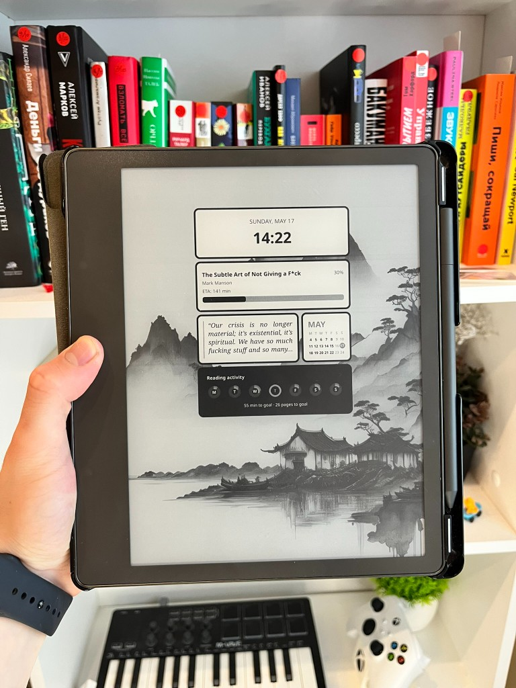

[English](README.md) | Русский

# Sleepscreen widgets

Плагин для [KOReader](https://github.com/koreader/koreader), который заменяет стандартный экран сна на настраиваемую сетку виджетов в стиле iOS. 

## Возможности

### Типы виджетов

- **Дата и время** — виджет с текущей датой и временем (дата застывает на моменте ухода в сон).
- **Часы** — цифровой или аналоговый циферблат.
- **Батарея** — карточка с уровнем заряда батареи.
- **Текущая книга** — название, автор, прогресс и оставшееся время чтения.
- **Случайная цитата** — случайная сохранённая цитата из текущей книги.
- **Календарь** — сетка месяца или только сегодняшний день.

## Настройка KOReader

1. Включите **Settings** → **Screen** → **Sleep screen** → **Sleep screen message** → **Add custom message to sleep screen**.

2. Откройте **Container and position** и выберите **Banner**, а не **Box**.

Если что-то из этого не сделано, KOReader покажет обычное сообщение на экране сна вместо сетки.

## Настройка плагина

После включения плагина в **Plugin management** плагин можно настроить в **Screen → Screensaver → Sleepscreen widgets**

### Доступные настройки

- **Произвольный размер и положение виджетов** — можно выбрать как ряд, так и ширину каждого из виджетов
- **Светлая и тёмная тема** — у многих виджетов есть параметр **Тема карточки**: **Светлая** или **Тёмная**, чтобы карточки нормально читались на разном фоне экрана сна.
- **Общие настройки** — скругление углов, отступы между ячейками сетки и положение сетки относительно краев экрана.

## Установка

1. Скопируйте папку плагина в каталог `plugins` KOReader, например:  
   `koreader/plugins/sleepscreenwidgets.koplugin/`
2. Перезапустите KOReader и включите плагин в меню.
